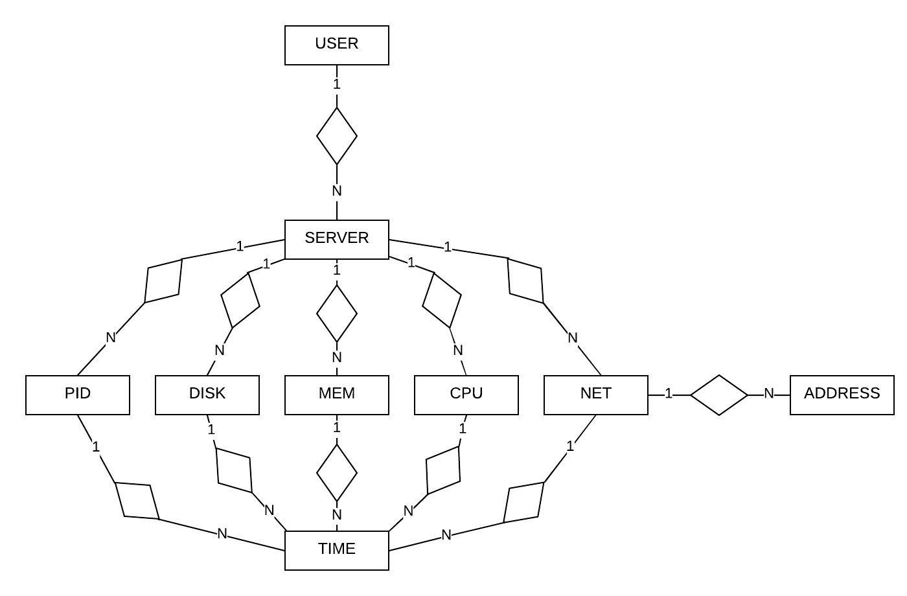

#Introducció

En aquest projecte final de l'assignatura hem creat una aplicació d'Internet on un usuari pot veure a temps real totes les dades dels seus servidors.
Podrem veure percentatges d'espai lliure o utilitzat en els servidors, utilització de la xarxa, utilització de la cpu o també els processos que hi corren.

Per poder dur a terme aquest projecte, hem instal·lat els paquets llistats en el fitxer a les nostres màquines per: Intal\·lar les llibreries necessàries per poder treballar amb la framework de Laravel i per poder obtenir mitjançant un script de python3 les dades del servidor.

Arxiu que ens permet instal·lar tot el necessari per dur a terme el monitoratge i treballar amb la frame:

\lstinputlisting[language=bash , caption="installer"]{installer}

Aquest arxiu instal·larà a grans trets: Python3.6 en l'última versió disponible i la llibreria psutils per poder obtenir les dades del monitoratge; PHP a una versió suficient per poder usar Laravel, mysql per poder gestionar la base de dades, el composer també per Laravel i finalment apache2 per si es vol configurar aquest pel projecte.

#Python

Aprofitant la llibreria de psutils, obtenim les dades del servidor. Amb la comanda psutil.disk_partitions() obtenim les dades del disc, amb psutil.net_connections() obtenim dades de la connexió, amb la comanda psutil.virtual_memory() i amb psutil.net_if_addrs() obtenim dades de les adreces de la xarxa. Finalment, aprofitem la llibreria json per enviar les dades.

#PHP

Malgrat podríem fer aquest projecte únicament amb aquest llenguatge però, l'utilitzarem principalment per utilitzar la framework.

Principalment usarem la comanda: php artisan *comand* per poder fer moltes coses.

Un cop ens van arribant les dades des de l'arxiu de python, les hem de classificar segons el que vulguem veure. Hem creat diferents mòduls on a cada mòdul farem diferents relacions i classificarem les dades:

{width="500px"}

##User

Principalment tenim el modul **user**, on demanem a l'usuari que ens doni un nom, el seu email i la contrasenya, i crearem un token (anoment api_token).

Per fer-ho segur tenim la funcio *setPasswordAttribute*, que aquí creem el hash de la contrasenya. Per últim veiem l'última funció *servers*, on fem la relació amb l'esquema anterior, és a dir, un usuari pot tenir diversos servidors.

\lstinputlisting[language=php , caption="User.php"]{./Moni/app/User.php}

##Server

En el modul **server** primerament rebrem el món, el sistema operatiu actiu, la seva versió, el processador, node i la plataforma utilitzada, i tot un seguit de funcions on podem veure la relació amb la resta de mòduls. Primer tenim la relació amb user, on veiem que el servidor només correspon a un únic usuari, però les següents relacions podem comprobar com per exemple un servidor pot tenir diversos processos (*return $this->;;hasMany(Pid::class);*), i així amb els moduls **net**, **Disk**, **Cpu**, **Mem** i **Net**.

\lstinputlisting[language=php , caption="Server.php"]{./Moni/app/Server.php}

##Net, Pid, Disk, Cpu, Mem, Net

En aquests mòduls pràcticament farem el mateix en tots. De tota la informació que ens arriba agafem la que ens sigui necessària segons el modul, i fem la serva relació amb la resta de mòduls. Per exemple en el mòdul **Disk** ens interès el seu espai lliure, total, ocupat i el percentatge corresponent, i després fem la relació amb el mòdul **Server** i **Time**

\lstinputlisting[language=php , caption="Disk.php"]{./Moni/app/Disk.php}

##Address

Mostra totes les adreçes IP del teu servido amb les interficies corresponent. Aquest és relaciona amb el modul **Net**, ja que una xarxa pot tenir diferents IP.

\lstinputlisting[language=php , caption="Address.php"]{./Moni/app/Address.php}

##Controller

\lstinputlisting[language=php , caption="Time.php"]{./Moni/app/Http/MoniController.php}
