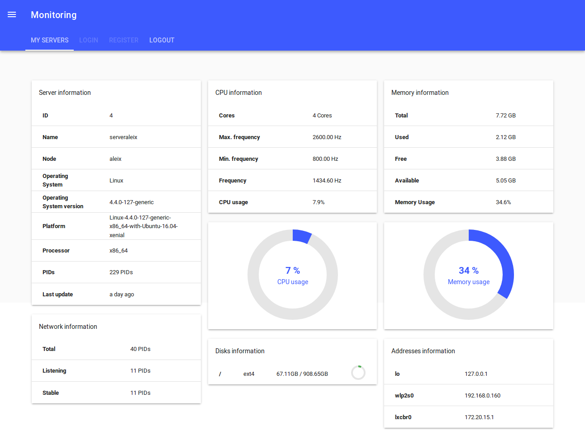

# Introducció

En aquest projecte final de l'assignatura hem creat una aplicació d'Internet on un usuari pot veure a temps real totes les dades dels seus servidors.
Podrem veure percentatges d'espai lliure o utilitzat en els servidors, utilització de la xarxa, utilització de la CPU o també els processos que hi corren.

Per poder dur a terme aquest projecte, hem instal\·lat els paquets llistats en el fitxer a les nostres màquines per: Intal\·lar les llibreries necessàries per poder treballar amb la framework de Laravel i per poder obtenir mitjançant un script de Python3 les dades del servidor.

Arxiu que ens permet instal·lar tot el necessari per dur a terme el monitoratge i treballar amb la frame:

\lstinputlisting[language=bash , caption=installer]{installer}

Aquest arxiu instal·larà a grans trets: Python3.6 en l'última versió disponible i la llibreria psutils per poder obtenir les dades del monitoratge; PHP a una versió suficient per poder usar Laravel, MySQL per poder gestionar la base de dades, el composer també per Laravel i finalment Apache2 per si es vol configurar aquest pel projecte.

\newpage

# Python

Per obtenir les dades del sistema que monitorarem a temps real hem utilitzat la llibreria psutils. Hem implementat un script de Python3.6 que recull aquestes dades.

Per afegir un nou servidor al sistema de monitoratge, cal executar aquest arxiu amb els següents paràmetres:

UBUNTU

```
./monitoring API_TOKEN SERVER_NAME INTERVAL(sec)
```

WINDOWS

```
./monitoring.exe API_TOKEN SERVER_NAME INTERVAL(sec)
```

**API_TOKEN:**
Obligatori. Serveix per autentificar-te al servidor.

**SERVER_NAME:**
Obligatori. Serveix per determinar el nom del servidor a utilitzar. En crea un nou si no existeix.

**INTERVAL(sec):**
Opcional. Serveix per indicar el temps d'actualització de les dades. Per defecte són 60sec.

Aquestes dades obtingudes per pas de paràmetre, juntament amb les dades obtingudes amb la llibreria psutils, s'envien amb post en JSON a una URL.

\lstinputlisting[language=python , caption=monitoring.py]{monitoring.py}

\newpage

# PHP

Malgrat podríem fer aquest projecte únicament amb aquest llenguatge però, l'utilitzarem principalment per utilitzar la framework.

Principalment usarem la comanda: php artisan *comand* per poder fer moltes coses.

# Laravel, PHP i MySQL

Un cop ens van arribant les dades des de l'arxiu de Python, les hem de classificar segons el que vulguem veure. Hem creat diferents mòduls on a cada mòdul farem diferents relacions i classificarem les dades:

{width="500px"}

Gracies a l'ORM  de laravel, podrem traduir els diferents mòduls a una base de dades amb MySQL i es podrà gestionar la base de dades.

## User

Principalment tenim el mòdul **user**, on demanem a l'usuari que ens doni un nom, el seu email i la contrasenya, i crearem un token (anoment api_token).

Per fer-ho segur tenim la funció *setPasswordAttribute*, que aquí creem el hash de la contrasenya. Per últim veiem l'última funció *servers*, on fem la relació amb l'esquema anterior, és a dir, un usuari pot tenir diversos servidors.

\lstinputlisting[language=php , caption=User.php]{User.php}

## Server

En el modul **server** primerament rebrem el món, el sistema operatiu actiu, la seva versió, el processador, node i la plataforma utilitzada, i tot un seguit de funcions on podem veure la relació amb la resta de mòduls. Primer tenim la relació amb user, on veiem que el servidor només correspon a un únic usuari, però les següents relacions podem comprobar com per exemple un servidor pot tenir diversos processos (*return $this->hasMany(Pid::class);*), i així amb els mòduls **net**, **Disk**, **CPU**, **Mem** i **Net**.

\lstinputlisting[language=php , caption=Server.php]{Server.php}

## Net, Pid, Disk, CPU, Mem, Net

En aquests mòduls pràcticament farem el mateix en tots. De tota la informació que ens arriba agafem la que ens sigui necessària segons el modul, i fem la serva relació amb la resta de mòduls. Per exemple en el mòdul **Disk** ens interès el seu espai lliure, total, ocupat i el percentatge corresponent, i després fem la relació amb el mòdul **Server** i **Time**

\lstinputlisting[language=php , caption=Disk.php]{Disk.php}

## Address

Mostra totes les adreces IP del teu servidor amb les interfícies corresponent. Aquest és relaciona amb el mòdul **Net**, ja que una xarxa pot tenir diferents IP.

\lstinputlisting[language=php , caption=Address.php]{Address.php}

## Controller

\lstinputlisting[language=php , caption=Time.php]{MoniController.php}

## Routes:

En el projecte de Laravel usar 2 routes una per obtenir la interfície i un altre pel backend.

Route de backend:

\lstinputlisting[language=php , caption=api.php]{api.php}

Les línies de Route::post, envien l'execució amb un metode post a MoniController@lacommanda

El Route::middleware('auth:api') protegeix l'execucció que sigui l'usuari correcte mitjançant el token.

Route de la interfície:

\lstinputlisting[language=php , caption=web.php]{web.php}

Mitjançant la comanda post el que fa és obtenir la interfície.

# Web socket

Mitjançant el servei pusher, avisa que hi ha les dades noves mitjançant web sockets.

#Interfície

La interfície està basada en VueJS, creant un virtualDOM que és fàcilment actualitzable des de javascript. Com a disseny es fa servir vuetify per crear una interfície interactiva amb poca feina. Es fa servir websockets per escoltar i reaccionar als events.



# Autentificació

Es fa servir autentificació a través de tokens de 60 caràcters de longitud, generats per usuari al moment del registre.
